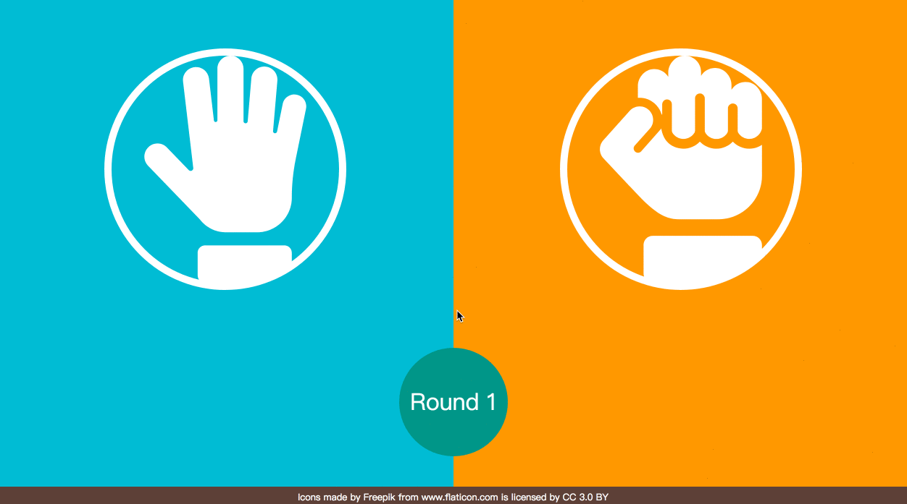

# Rock Paper Scissors

A small game sample is written with React.

# Demo
  

# Getting Started

    $ git clone https://github.com/tristachentw/rock-paper-scissors.git
    $ cd rock-paper-scissors
    $ npm install
    $ npm start

# Game Status

| Status | Description                                      |
|--------|--------------------------------------------------|
| New    | Initial game.                                    |
| Start  | Game is starting, waiting to stop.               |
| Stop   | Game is stoping, waiting to start.               |
| End    | If one player be a winner, the game will be end. |
